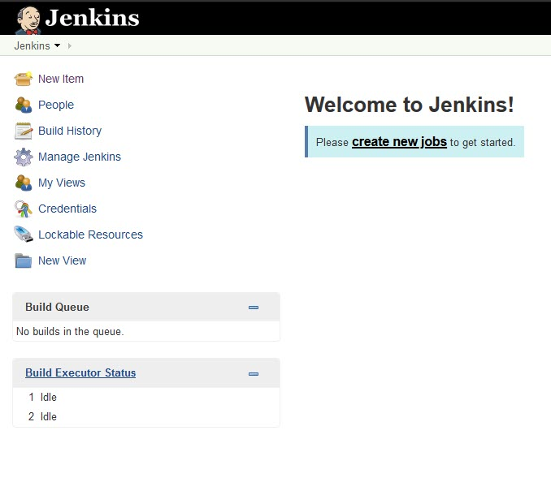

Jadi, apa sih CI / CD? keknya rame bener. CI / CD itu adalah *Continuous Integration* / *Continuous Delivery* atatu *Continuous Deployment*.

*Continuous Integration* bisa diartiin juga integrasi terus-menerus. Apa yang diintegrasi? Aplikasi yang lagi kita bangun. Bayangin, dalam satu tim ada yang ngerjain modul A, ada yang ngerjain modul B, ada yang bikin *web service* buat *searching*. Nah masing-masing dari modul itu bisa punya source code sendiri-sendiri yang terpisah. Padahal, sewaktu mau di *deliver* / *deploy* / *publish* harus menjadi satu kesatuan.

Nah, seandainya pekerjaan menyatukan berbagai modul itu bisa diotomatisasi sehingga *developer* bisa fokus di satu pekerjaan yaitu *develop*. Selain mengintegrasi / menyatukan berbagai modul tersebut, *Continuous Integration* juga memastikan hubungan antar modul tidak rusak. Sehingga ketika dijalankan setelah di-*deploy* pun, tetap berjalan baik sebagaimana mestinya. Caranya? Continuous Integration akan menyediakan alur kerja / *workflow* yang memastikan setiap langkah yang ditempuh untuk menyatukan berbagai modul tersebut tidak berubah dan selalu konstan setiap kali penyatuan dilakukan.

Beberapa *workflow* yang umum di *Continuous Integration* itu kaya gini:

1. Menjalankan *test* setiap kali *branch* tertentu terindikasi ada *commit* baru.
2. Mengotomatisasi *build* dari *fresh repo checkout* dan setiap kali ada *commit* di *branch* tertentu.

Lalu, yang satu lagi adalah *Continuous Delivery* / *Continuous Deployment*. Sebenernya 2 hal ini rada berbeda, *Continuous Delivery* memastikan setiap langkah yang ditempuh untuk membuat *package* / *artifact* secara manual, bisa ditempuh dengan otomatis tanpa mengurangi hasil *package* / *artifact* yang akan di deploy. *Package* / *artifact* ini adalah berkas zip / terkompres yang akan di-*deploy* nantinya.

*Workflow* umum dari *Continuous Delivery* bisa kaya gini:

1. Menerima / membaca hasil *build* dari *Continuous Integration*.
2. Melakukan *post-build action*. Atau aksi yang akan dijalankan setelah *code* di *build*. Bisa mengirimkan *email* ketika *build*-nya gagal atau memanggil *web api* untuk mengirimkan *artifact* untuk dibaca oleh *Continuous Deployment*.

Sedangkan *Continuous Deployment* memastikan setiap langkah yang ditempuh untuk men-*deploy* tetep konstan dan gak berubah. Apakah itu isi, lokasi, konfigurasi, ataupun langkah dari pen-*deploy*-an itu sendiri.

*Workflow* umumnya bisa kaya gini:

1. Baca *artifact*, *deploy* ke lokasi yang ditentuin.
2. Menjalankan otomatisasi konfigurasi berdasarkan *environment* tujuan.

Di kesempatan kali ini, gue akan mencoba CI / CD pake Jenkins. Sebenernya dulu sempet pernah nyoba tapi gagal terus dan baru kesampean lagi nyoba sekarang.

Gue gakkan bahas soal *install*-meng-*install* karena di situsnya udah ada. Dan kalo pake *Windows* cukup *install* *.msi*-nya ajah, (❁´◡`❁). Yang gue bahas gimana cara konfigurasi dia bisa jalan dan nge-*build*.

*Screen* pertama yang ditampilin setelah *login* kira-kira kaya gini

Kita bisa langsung *create new jobs* dari *dashboard*.

Pertama-tama clone project dari [sini](https://github.com/asakura89/Stripped.git) dulu

Pertama-tama clone project dari [sini](https://stash.xtremax.com/scm/~dita.subrata/jenkins-sharing-session.git) dulu.